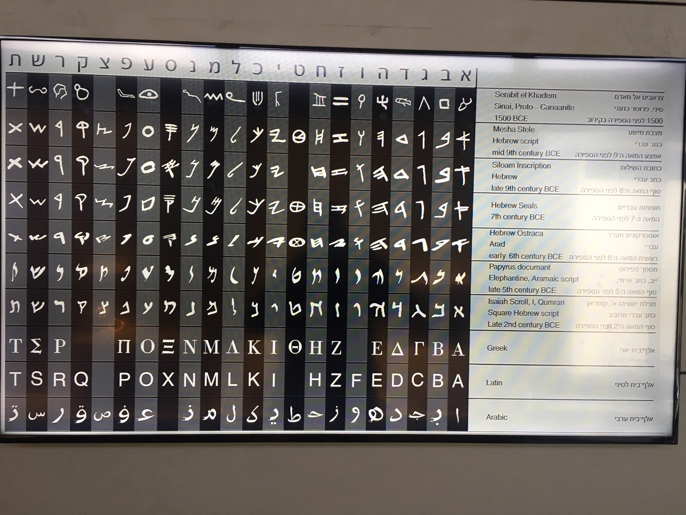

```{=html}
<style>
  .nav-pills>li>a:hover, .nav-pills>li>a:focus, .nav-pills>li.active>a,     .nav-pills>li.active>a:hover, .nav-pills>li.active>a:focus{
     background-color: CadetBlue; 
     }
</style>
```
<!-- https://www.angularfix.com/2021/10/how-to-change-tabset-colors-without.html -->

```{r setup, include=FALSE}
    knitr::opts_chunk$set(message=FALSE,warning=FALSE, cache=TRUE)
```

**SCSC was founded on 22 June 2018 in Lisbon (Portugal).**

The [Journal of Cultural Cognitive Science](https://www.springer.com/journal/41809) (published by Springer Nature) is the official journal of the society.

<!-- |  |  | {width="1024"} | -->
<!-- |---------------------------------|------------------------|---------------------------------------| -->
::: col-sm-6
# **The Society for the Cognitive Science of Culture**
The [Journal of Cultural Cognitive Science](https://www.springer.com/journal/41809) (published by Springer Nature) is the official journal of the society.


:::

::: col-sm-6

#  {.tabset .tabset-fade .tabset-pills}

# News {.tabset .tabset-fade .tabset-pills}

The 6th SCSC workshop is provisionally scheduled to be held in Rio de Janeiro (Brazil) in September 2023, organised by Marcus Maia and Bruna Franchetto.

## SCSC Governing Board 2021-2022

-   **President**: Falk Huettig (Nijmegen, Netherlands)

-   **Vice President**: Régine Kolinsky (Brussels, Belgium)

-   **Treasurer**: Susana Araújo (Lisbon, Portugal)

-   **One World Representative and Director of Communications**: Ramesh Mishra (Hyderabad, India)

-   **Diversity Representative**: Zohar Eviatar (Haifa, Israel)

-   **Student/Post-doc Representative**: Mayur Jartarkar (Goa, India)

-   **Web Representative**: Alexis Hervais-Adelman (Zürich, Switzerland)

-   **Sponsoring Representative and Fiscal Council**: Thomas Lachmann (Kaiserslautern, Germany)

-   **Chair of the General Assembly**: Jon Duñabeitia (Nebrija University, Spain)

## Society Aims

Traditional cognitive science has largely ignored cultural influences on cognition and has also pre-dominantly concentrated on a group of people who are not particularly representative of the world's population as a whole. Yet, today, we have an increasing amount of empirical and theoretical work that emphasizes cultural and social influences on mind and brain, including through bodily modulations. An increasing number of researchers believe that cognitive science cannot ignore culture as a crucial factor impacting mental processes and brain functioning. A focus on individuals and their experiences in cultural environments has become more and more important. This approach has emerged in all fields that have been associated with cognitive science, from neuroscience to philosophy of mind.

We believe it is indispensable to look at different cultures and diverse participant populations so that we can understand what kind of findings from the mostly Western research body generalize (or not) to diverse populations and across cultures. We want to explore, for example, how cultural inventions like written words, numbers, music, and belief systems shape the mind and brain from the beginning of our lives and through exposure to cultural objects across the lifecycle. We welcome contributions from all these fields of research.This society aims to encourage discussion of the latest developments in the cognitive science of culture, to provide a platform for exchanging ideas, and a network to foster collaborations among interested researchers. We particularly encourage research involving non-WEIRD participant populations. We want to understand the human mind (and not just the minds of Western undergraduates) and how cultural objects (e.g., literacy; religion), including those within culture at macro-level, can shape the human brain and mind. We especially encourage participation by researchers from all parts of the world. Another important aim of the society is public outreach, for instance, to promote the application of research findings for the greater good of humanity.

[Join The Society](Join.html)

## Founding Members

Carmit Altman (Bar-Ilan University, Israel), [carmit.altman\@gmail.com](mailto:carmit.altman@gmail.com){.email}

Susana Araújo (University of Lisbon, Portugal), [smaraujo\@psicologia.ulisboa.pt](mailto:smaraujo@psicologia.ulisboa.pt){.email}

Sharon Armon-Lotem (Bar-Ilan University, Israel), [sharon.armonlotem\@gmail.com](mailto:sharon.armonlotem@gmail.com){.email}

Veeky Baths (Bits-Pilani University Goa, India),[veeky\@goa.bits-pilani.ac.in](mailto:veeky@goa.bits-pilani.ac.in){.email}

Michal Ben-Shachar (Bar-Ilan University, Israel), [michal.benshachar\@gmail.com](mailto:michal.benshachar@gmail.com){.email}

Gal Ben-Yehudah (Open University of Israel), [gal.benyehudah\@gmail.com](mailto:gal.benyehudah@gmail.com){.email}

Tali Bitan (University of Haifa, Israel), [tbitan\@research.haifa.ac.il](mailto:tbitan@research.haifa.ac.il){.email}

Silvia Brem (University of Zürich, Switzerland), [silvia.brem\@uzh.ch](mailto:silvia.brem@uzh.ch){.email}

Sao Luis Castro (University of Porto, Portugal), [slcastro\@fpce.up.pt](mailto:slcastro@fpce.up.pt){.email}

Peter Daniels (Independent Scholar, US), [grammatim\@verizon.net](mailto:grammatim@verizon.net){.email}

Tamar Degani (University of Haifa, Israel), [tamardegani\@gmail.com](mailto:tamardegani@gmail.com){.email}

Jon Andoni Duñabeitia (Nebrija University, Spain), [jdunabeitia\@nebrija.es](mailto:jdunabeitia@nebrija.es){.email}

Zohar Eviatar (University of Haifa, Israel), [zohare\@research.haifa.ac.il](mailto:zohare@research.haifa.ac.il){.email}

Laurie Feldman (State University of New York at Albany, US) ,[lfeldman\@albany.edu](mailto:lfeldman@albany.edu){.email}

Tânia Fernandes (University of Lisbon, Portugal), [taniapgfernandes\@gmail.com](mailto:taniapgfernandes@gmail.com){.email}

Naama Friedmann (Tel Aviv University, Israel), [naamafr\@post.tau.ac.il](mailto:naamafr@post.tau.ac.il){.email}

Falk Huettig (Max Planck Institute for Psycholinguistics, Nijmegen, The Netherlands), [Falk.Huettig\@mpi.nl](mailto:Falk.Huettig@mpi.nl){.email}

Asaid Khateb (University of Haifa, Israel), [akhateb\@edu.haifa.ac.il](mailto:akhateb@edu.haifa.ac.il){.email}

Régine Kolinsky (Free University of Brussels, Belgium), [rkolins\@ulb.ac.be](mailto:rkolins@ulb.ac.be){.email}

Hamutal Kreiner (Ruppin Academic Center, Israel), [hamutalk\@ruppin.ac.il](mailto:hamutalk@ruppin.ac.il){.email}

Thomas Lachmann (University of Kaiserslautern, Germany), [lachmann\@rhrk.uni-kl.de](mailto:lachmann@rhrk.uni-kl.de){.email}

Nira Mashal (Bar-Ilan University, Israel), [nmashal2\@gmail.com](mailto:nmashal2@gmail.com){.email}

Ramesh Mishra (University of Hyderabad, India), [rkmishra\@uohyd.ac.in](mailto:rkmishra@uohyd.ac.in){.email}

José Morais (Free University of Brussels, Belgium), [jmorais\@ulb.ac.be](mailto:jmorais@ulb.ac.be){.email}

John Myhill (University of Haifa, Israel), [john\@research.haifa.ac.il](mailto:john@research.haifa.ac.il){.email}

Joao Batista Oliveira (Alfa e Beto Institute, Brazil), [jmeduc\@gmail.com](mailto:jmeduc@gmail.com){.email}

Prakash Padakannaya (University of Mysore, India), [prakashp99\@gmail.com](mailto:prakashp99@gmail.com){.email}

Lekhnath Pathak (Tribhuvan University Kathmandu, Nepal), [lekhnathspathak\@gmail.com](mailto:lekhnathspathak@gmail.com){.email}

Orna Peleg (Tel Aviv University, Israel), [pelegor\@post.tau.ac.il](mailto:pelegor@post.tau.ac.il){.email}

Manuel Perea (University of Valencia , Spain), [Manuel.Perea\@uv.es](mailto:Manuel.Perea@uv.es){.email}

Anat Prior (University of Haifa, Israel), [anat.prior\@gmail.com](mailto:anat.prior@gmail.com){.email}

Alexandra Reis (University of Algarve, Portugal), [aireis\@ualg.pt](mailto:aireis@ualg.pt){.email}

Dave Roberts (Independent Scholar, Togo), [rbrdvd\@gmail.com](mailto:rbrdvd@gmail.com){.email}

Elinor Saiegh-Haddad (Bar-Ilan University, Israel), [aieghe\@mail.biu.ac.il](mailto:aieghe@mail.biu.ac.il){.email}

David Share (University of Haifa, Israel), [dshare\@edu.haifa.ac.il](mailto:dshare@edu.haifa.ac.il){.email}

Mila Schwartz (University of Haifa, Israel), [milasch\@post.bgu.ac.il](mailto:milasch@post.bgu.ac.il){.email}

:::
