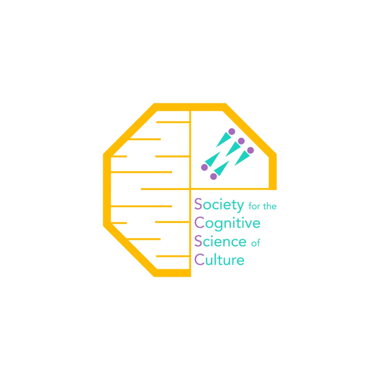

```{=html}
<style type="text/css">
.title {
  display: none;
}

#getting-started img {
  margin-right: 50px;
}

</style>
```
<div class="row" style="padding-top: 30px;">

::: col-sm-6
# **The Society for the Cognitive Science of Culture**
This is the website of the Society for the Cognitive Science of Culture. 


## [**Mission**](SocietyInfo.html)
**The SCSC aims to promote research into the role of culture on cognition, with a particular focus on extending research beyond WEIRD populations. We welcome members from the global research community and we aim to foster collaborations between researchers who are interested in understanding the role of culture and cultural artefacts on the human mind.** 


## **NEWS**

**The Next [Annual Meeting]('https://esdeveniments.uv.es/107864/detail/sixth-annual-meeting-of-the-society-for-the-cognitive-science-of-culture.html') of the Society will be held 11-13 April 2024 in Valencia, Spain, with satellite symposia on 10th April**
```{r Annual Meeting Link Picture, echo=FALSE, out.width='512px',fig.align='center',tidy=FALSE}
source('image_link.R')
il<-image_link('https://www.uv.es/esdeveniment/2023/Sixth-Annual-Meeting-Scie/JMPD8_SCSC_2024_VLC_centrado.png','https://esdeveniments.uv.es/107864/detail/sixth-annual-meeting-of-the-society-for-the-cognitive-science-of-culture.html',width='512px')
il
```
<br/><br/>

***Journal News***
We are proud to announce that the society's journal: [The Journal of Cultural Cognitive Science](https://www.springer.com/journal/41809) received its first Impact Factor (1.8) [We welcome your submissions!](https://www.springer.com/journal/41809)

**Copyright © SCSC, 2023**

Except where noted, all content of this website is copyright of the Society for the Cognitive Science of Culture, and may not be reused without permission.

Website design is based on <https://github.com/pihej121/LabJournal.git>
:::

::: col-sm-6
```{=html}
<!--
### [SCSC](https://scsoc.github.io)
-->
```
<a href = "https://scsoc.github.io"> {width="800"} </a>
:::
